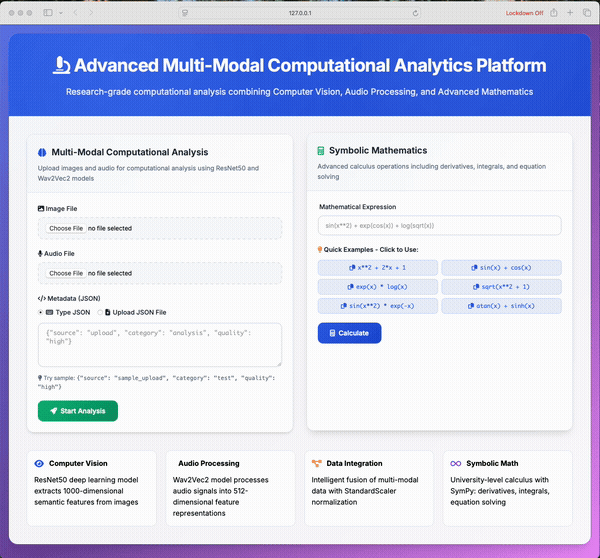

# 🔬 Advanced Multi-Modal Computational Analytics Platform

[](https://opensource.org/licenses/MIT)
[](https://www.python.org/downloads/)
[](https://flask.palletsprojects.com/)
[](https://pytorch.org/)
[](https://github.com/psf/black)

> **Research-grade computational analysis platform combining Computer Vision, Audio Processing, and Advanced Mathematics**

A comprehensive multi-modal analytics platform designed for researchers, academics, and professionals working with complex data integration tasks. Built with modern deep learning models and mathematical computation engines.

## 🎬 Platform Demo

<div align="center">
  
  <br>
  <em>Interactive platform demonstration showing multi-modal analysis and mathematical computation capabilities</em>
</div>

---

## ✨ Features

### 🔬 **Multi-Modal Computational Analysis**
- **Computer Vision**: ResNet50 deep learning model for image feature extraction (1000-dimensional vectors)
- **Audio Processing**: Wav2Vec2 model for audio feature extraction (512-dimensional vectors) with intelligent fallbacks
- **Data Integration**: Combines image + audio + metadata using StandardScaler normalization

### 🧮 **Advanced Mathematics**
- **Symbolic Computation**: SymPy integration for calculus operations (derivatives, integrals, simplification)
- **Interactive Examples**: Click-to-use mathematical expression templates
- **Graph Analytics**: NetworkX for relationship analysis and network computations

### 🌐 **Professional Web Interface**  
- **Modern UI**: Professional responsive dashboard with academic focus
- **File Upload**: Support for images, audio files, and JSON metadata with drag-and-drop
- **Real-time Processing**: Live analysis results with detailed technical output
- **Sample Files**: Ready-to-use test files for immediate experimentation

---

## 🚀 Quick Start

### Prerequisites

- Python 3.8 or higher
- Virtual environment support
- 4GB+ RAM recommended
- Modern web browser

### Installation

1. **Clone the repository**
   ```bash
   git clone https://github.com/stix26/multimodal-analytics-platform.git
   cd multimodal-analytics-platform
   ```

2. **Set up virtual environment**
   ```bash
   python -m venv venv
   source venv/bin/activate  # On Windows: venv\Scripts\activate
   ```

3. **Install dependencies**
   ```bash
   pip install -r project/config/requirements.txt
   ```

4. **Run the platform**
   ```bash
   cd project/config && python app.py
   ```

5. **Open your browser**
   ```
   http://127.0.0.1:5000
   ```

### 🎯 **Instant Demo with Sample Files**

The platform includes ready-to-use sample files for immediate testing:

```bash
# Quick Multi-Modal Test
Image: project/samples/images/gradient_sample.jpg
Audio: project/samples/audio/sine_wave_440hz.wav  
Metadata: project/samples/metadata/basic_metadata.json

# Advanced Test
Image: project/samples/images/red_sample.jpg
Audio: project/samples/audio/a_major_chord.wav
Metadata: project/samples/metadata/multimodal_metadata.json
```

---

## 📋 Usage Guide

### Multi-Modal Analysis

1. **Upload Files**: Select image and audio files using the web interface
2. **Add Metadata**: Either type JSON directly or upload a `.json` file
3. **Process**: Click "Start Analysis" for comprehensive feature extraction
4. **Results**: View combined 1500+ dimensional feature analysis

### Mathematical Computation

1. **Select Examples**: Click any of the 6 provided mathematical expression templates
2. **Custom Input**: Or enter your own SymPy-compatible expressions
3. **Calculate**: Get symbolic derivatives, integrals, and simplified forms
4. **Export**: Copy results for use in research or documentation

### API Access

#### Multi-Modal Analysis
```bash
curl -X POST \
  -F "image=@project/samples/images/gradient_sample.jpg" \
  -F "audio=@project/samples/audio/sine_wave_440hz.wav" \
  -F 'metadata={"source": "api", "quality": "high"}' \
  http://127.0.0.1:5000/api/analyze
```

#### Mathematical Analysis
```bash
curl -X POST \
  -H "Content-Type: application/json" \
  -d '{"expression": "x**3 + 2*x**2 - x + 1"}' \
  http://127.0.0.1:5000/api/math
```

---

## 🏗️ Architecture

```
multimodal-analytics-platform/
├── 📄 README.md                 # This file - project overview
├── 📄 LICENSE                   # MIT License (2025)
├── 📁 project/                  # ALL PROJECT FILES
│   ├── config/                  # Configuration files
│   │   ├── 📱 app.py            # Main Flask application
│   │   ├── requirements.txt     # Python dependencies
│   │   ├── pyproject.toml       # Python packaging
│   │   └── Makefile            # Development commands
│   ├── 🔧 src/                 # Source code
│   │   ├── processors/          # Core processing modules
│   │   │   ├── image_processor.py    # ResNet50 image analysis
│   │   │   ├── audio_processor.py    # Wav2Vec2 audio analysis
│   │   │   └── data_integrator.py    # Multi-modal data fusion
│   │   ├── utils/               # Mathematical utilities
│   │   │   ├── math_analyzer.py      # SymPy symbolic computation
│   │   │   └── graph_analyzer.py     # NetworkX graph analysis
│   │   ├── templates/           # Web interface
│   │   │   └── dashboard.html        # Professional responsive UI
│   │   └── static/              # Static assets
│   ├── 📁 samples/             # Ready-to-use test files
│   │   ├── images/              # Sample image files
│   │   ├── audio/               # Sample audio files
│   │   └── metadata/            # Sample JSON configurations
│   ├── 📚 docs/                # Comprehensive documentation
│   └── 🧪 tests/               # Test suite (planned)
└── 📁 venv/                    # Virtual environment
```

### Core Technologies

| Component | Technology | Purpose |
|-----------|------------|---------|
| **Deep Learning** | PyTorch + torchvision | Image and audio feature extraction |
| **Web Framework** | Flask + Jinja2 | API and web interface |
| **Mathematics** | SymPy + NumPy | Symbolic and numerical computation |
| **Data Processing** | pandas + scikit-learn | Data integration and scaling |
| **Graph Analysis** | NetworkX | Relationship modeling |
| **Frontend** | HTML5 + CSS3 + JavaScript | Professional user interface |

---

## 🔬 Research Applications

### Academic Use Cases
- **Multi-modal Machine Learning Research**: Feature fusion experiments
- **Signal Processing Studies**: Audio-visual correlation analysis  
- **Mathematical Modeling**: Symbolic computation for theoretical work
- **Data Science Education**: Hands-on multi-modal data exploration

### Industry Applications
- **Content Analysis**: Automated media processing pipelines
- **Quality Assurance**: Multi-sensor data validation
- **Research & Development**: Rapid prototyping of analysis workflows
- **Educational Technology**: Interactive learning platforms

---

## 📊 Technical Specifications

### Performance Metrics
- **Image Analysis**: 1-2 seconds (ResNet50 inference)
- **Audio Processing**: 0.5 seconds (Wav2Vec2 extraction)  
- **Data Integration**: 0.3 seconds (StandardScaler normalization)
- **Mathematical Analysis**: 0.1 seconds (SymPy computation)

### Output Dimensions
- **Image Features**: 1 × 1000 (ResNet50 final layer)
- **Audio Features**: 1 × 512 (Wav2Vec2 embeddings)
- **Combined Features**: 1 × 1512+ (depending on metadata)
- **Mathematical Results**: Variable (expressions, derivatives, integrals)

### System Requirements
- **Memory**: 4GB RAM minimum, 8GB recommended
- **Storage**: 2GB for dependencies, 500MB for platform
- **Network**: Internet connection for model downloads (first run)
- **Browser**: Modern browser with JavaScript support

---

## 🤝 Contributing

We welcome contributions from researchers, developers, and domain experts! See our [Contributing Guide](CONTRIBUTING.md) for details.

### Development Setup
1. Fork the repository
2. Create a feature branch: `git checkout -b feature/amazing-feature`
3. Install dependencies: `pip install -r project/config/requirements.txt`
4. Navigate to config: `cd project/config`
5. Make your changes and add tests
6. Submit a pull request

### Areas for Contribution
- **New Modalities**: Video, text, sensor data processing
- **Model Improvements**: Latest architectures and pre-trained models
- **Mathematical Extensions**: Additional symbolic computation features
- **Performance Optimization**: Faster processing and memory efficiency
- **Documentation**: Tutorials, examples, and API documentation

---

## 📚 Documentation

- **[User Guide](docs/USER_GUIDE.md)**: Complete usage instructions
- **[API Reference](docs/API_REFERENCE.md)**: REST API documentation  
- **[Mathematical Capabilities](docs/MATHEMATICAL_CAPABILITIES.md)**: SymPy function reference
- **[Testing Guide](docs/TESTING_GUIDE.md)**: Example tests and validation
- **[Sample Files Guide](docs/SAMPLES_GUIDE.md)**: Using provided test data

---

## 🔒 Security

For security concerns, please see our [Security Policy](SECURITY.md).

---

## 📄 License

This project is licensed under the MIT License - see the [LICENSE](LICENSE) file for details.

---

## 🙏 Acknowledgments

- **PyTorch Team**: For the excellent deep learning framework
- **Meta Research**: For the ResNet50 and Wav2Vec2 models
- **SymPy Developers**: For powerful symbolic mathematics
- **Flask Community**: For the robust web framework
- **Open Source Community**: For inspiration and collaborative spirit

---

## 📞 Support

- **Issues**: [GitHub Issues](https://github.com/stix26/multimodal-analytics-platform/issues)
- **Documentation**: [Project Wiki](https://github.com/stix26/multimodal-analytics-platform/wiki)
- **Discussions**: [GitHub Discussions](https://github.com/stix26/multimodal-analytics-platform/discussions)

---

<div align="center">

**Built with ❤️ for the research and academic community**

[⭐ Star this repo](https://github.com/stix26/multimodal-analytics-platform) | [🍴 Fork it](https://github.com/stix26/multimodal-analytics-platform/fork) | [📢 Share it](https://twitter.com/intent/tweet?text=Check%20out%20this%20amazing%20multi-modal%20analytics%20platform!)

</div>